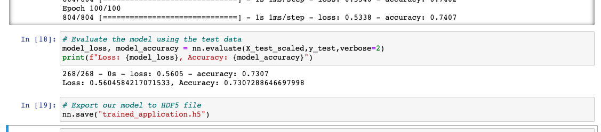
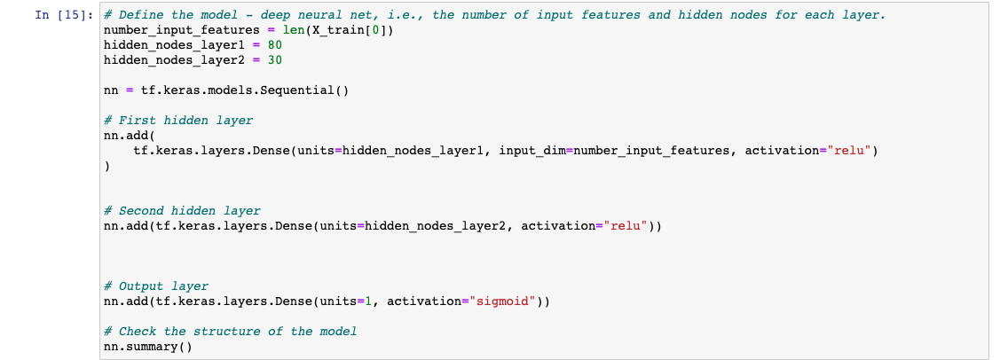
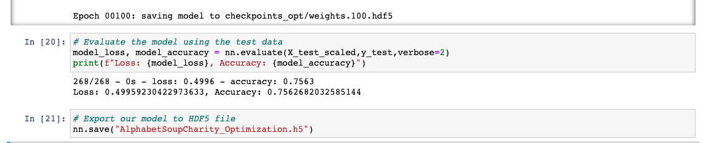
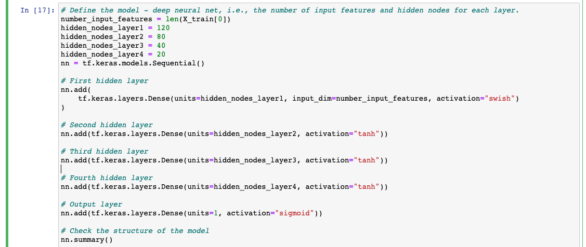

# Neural_Network_Charity_Analysis

## Overview of Analysis
The goal of the project was to create a neural network to design a binary classifier to predict whether applicant would be successful if funded by the client, Alphabet Soup.  An initial model was built and then optimized with additional neurons, hidden layers, and changes to activation functions and input data binning styles.

## Results

### Data Preprocessing

- The target varible was the "IS_SUCCESSFUL" column in the provided dataset.

- The features variables were initially the following the base model: 
    1. STATUS
    2. APPLICATION TYPE - (binned counts less than 500 to 'other') OneHot Encoded
    3. AFFILIATION - OneHot Encoded
    4. CLASSIFICATION - (binned counts less than 1000 to 'other') OneHot Encoded
    5. USE_CASE - OneHot Encoded
    6. ORGANIZATION - OneHot Encoded
    7. INCOME_AMT - OneHot Encoded
    8. SPECIAL_CONSIDERATIONS -OneHot Encoded
    9. ASK_AMT

- EIN and NAME data was dropped from the based model.  However is was necessary to add NAMES back in and bin to acheive a higher accuracy score.

### Compiling, Training, and Model Evaluation

- The initial model was set up with two hidden layers.  The activation functions were relu, relu and sigmoid for the output layer. 
    - 2 hidden layers: 80 and 30 neutrons with relu activation functions
    - Output layer utilized sigmoid function

    - The accuracy score of the initial model is reflected in figure 1.

- Desired model performance of accuracy in excess of 75% was achieved (see fig 4)

- The optimized model was changed through a series of steps listed below:
    - NAME data was added back and binned with values less than 75 set the "other" and data was added to the OneHot Encoder 
    - APPLICATION_TYPE binning was reduced to 50
    - CLASSIFICATION binning was reduced to 50
    - Two additional hidden layers were added. (figure 3)
    - Neurons were increased to 120, 80, 40, 20 per layer.
    - Activation functions were changed to swish, tanh, tanh, tanh.
    - Output layer remained sigmoid

After multiple optimization steps the accuracy improved to 75.6% and is reflected in figure 4.

## Summary

The target goal of 75% was achieved as seen in the output from the optimized model above.

|    | Base Model | Optimized Model |
| ----| ------ | ----- |
| Accuracy | 0.731 | 0.756 |

As another model like logistic regression may be faster and less involved model where the outcome is known in the case of the successful flag.
